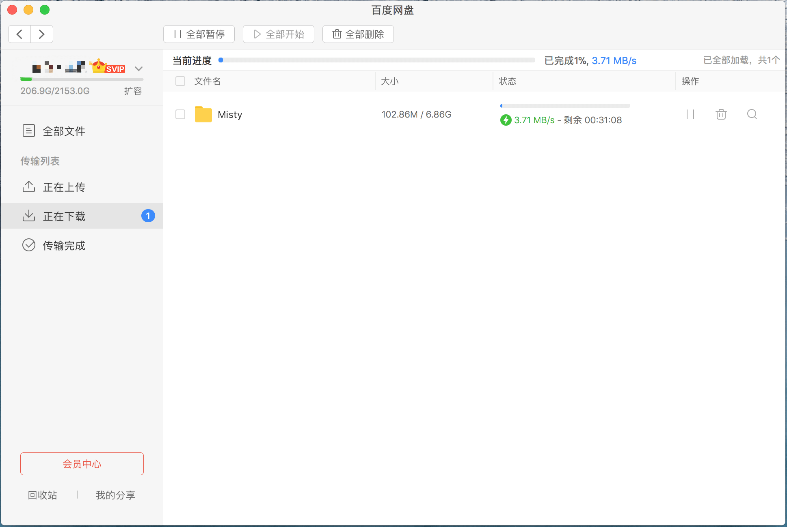
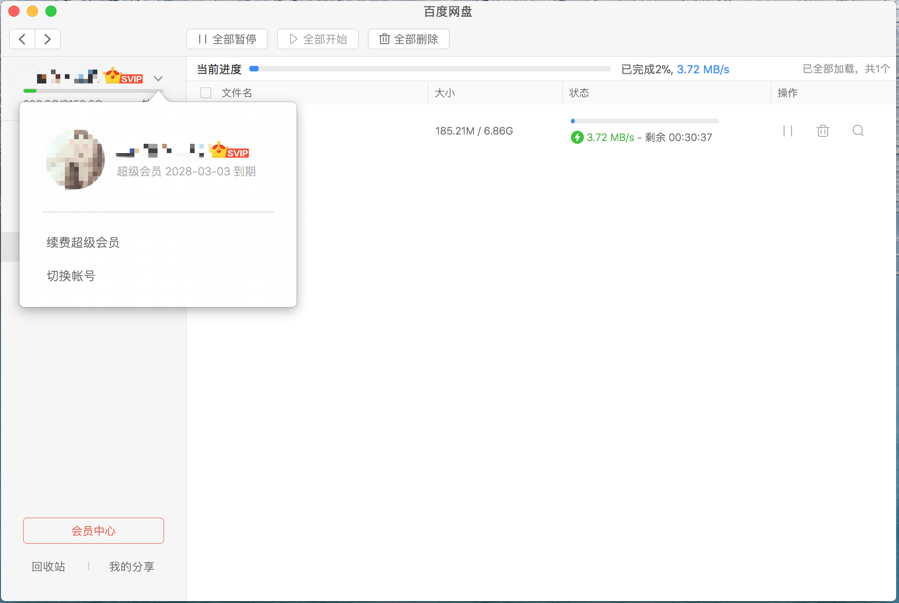
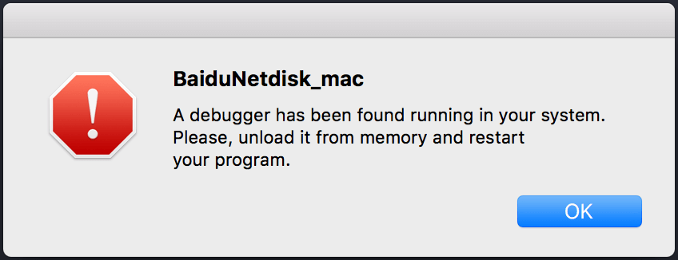

# BaiduNetdiskPlugin-macOS

  

### 说明
* **20191118更新，去掉自动检查更新功能。由于个人精力和能力有限，此项目不再更新支持新版网盘。如使用，请下载2.2.2版本 [官方下载地址][1]。**

* **连续下载10G数据后，会被限制速度到单文件20kb。所以，这个补丁偶尔用用就行，别一直用。**

* **免责声明：本项目旨在学习macOS 逆向的一点实践，不可使用于商业和个人其他意图。若使用不当，均由个人承担。**

* **本项目只用于学习和交流，有能力的请购买官方VIP服务。**

* **包含功能：本地SVIP图标显示，去除本地下载速度限制（服务端已添加限制单文件200kb左右），去除本地极速下载试用时长限制，倒计时永久显示8秒（服务的token大概3分钟过期。意思就是虽然不倒计时，但是3分钟后速度还是会降下来）。**

* **破解完成后，下载速度还是没有变化，可能是资源热度问题，或者是你已经进入百度网盘黑名单。**

* **此项目不再更新，有问题请Issue中找答案，或者添加我微信（博客关于有二维码），很高兴能帮到你。**

* **不会用的伸手狗请滚粗，别出问题后在这里乱咬人。**

### 安装

1. 懒人安装
* 打开`应用程序`->`实用工具`->`Terminal(终端)`，执行以下命令即可。(需要git支持)
`cd ~/Downloads && git clone https://github.com/CodeTips/BaiduNetdiskPlugin-macOS.git && ./BaiduNetdiskPlugin-macOS/Other/Install.sh`
2. 普通安装
* 点击`clone or download`下载项目并解压，打开`Terminal(终端)`，拖动解压后`Install.sh` 文件(在 Other 文件夹中)到 Terminal 回车即可。
3. 重编译安装
* 点击`clone or download`下载项目，解压运行`libBaiduNetdiskPlugin.xcodeproj`，然后`Edit Schemes`->`Executable`->`Other`->选择`百度网盘`。然后运行工程，因为百度网盘有 VMProtect加壳，运行后会有以下提示：

直接点击OK。
* 然后运行或者重启`百度网盘`，如果用户VIP状态改变，证明成功。

### 卸载

 1. 如果第一种方法安装的。
 * 打开`应用程序`->`实用工具`->`Terminal(终端)`，执行以下命令即可。`cd ~/Downloads && ./BaiduNetdiskPlugin-macOS/Other/Uninstall.sh`
 2. 通用卸载方法。
 * 打开`应用程序`->`实用工具`->`Terminal(终端)`，执行以下命令即可。`cd /Applications/BaiduNetdisk_mac.app/Contents/MacOS/ && rm -rf BaiduNetdisk_mac libBaiduNetdiskPlugin.framework && mv BaiduNetdisk_mac_backup BaiduNetdisk_mac`

**以上方法可以完全卸载此功能。如果还是不行的话，那么抱歉，可能您需要重新安装了**
 
### 依赖

* [insert_dylib](https://github.com/Tyilo/insert_dylib)

### 最后
* 使用愉快~

  [1]: http://issuecdn.baidupcs.com/issue/netdisk/MACguanjia/BaiduNetdisk_mac_2.2.2.dmg
